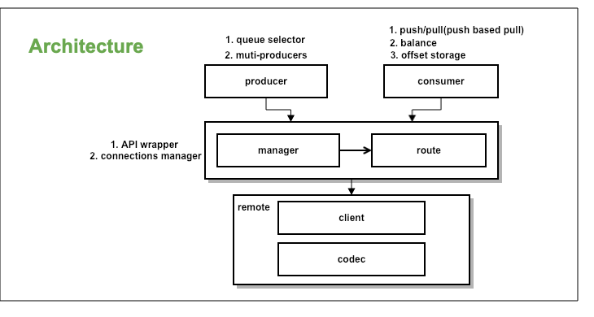

# RocketMQ Go Client Design Draft

## Architecture

### Overview


### Description
在RocketMQ Java Client的实现里面，代码耦合了大量的admin方面的功能， 其为了尽可能的提高代码复用率，代码的依赖关系较为复杂、接口的设计比
较重、语义的界限不够清晰。因此，为了避免简单的对Java代码进行翻译，故Go客户端进行了重新的设计，剥离了admin相关的逻辑。整体如上面的图所示，在逻辑层次上，按照请求
顺序，从下到上总共分为三层：
- remote层：client网络通信和私有协议层，将到每个到服务端(NameServer或Broker)的连接实体抽象为一个client结构，并在这里实现了网络数据的
序列/反序列化。
- 公共层：由于remote层对上层只暴露了`Sync/Async/Oneway`三个接口，所以对于特定的Request/Response、连接的管理、路由等信息的处理和维护、
其它`producer/consumer`共用的逻辑，均在这里实现。
- 业务逻辑层：在这里实现各种producer、consumer的语义。所有producer、consumer专有的逻辑，均放到这里实现，如`queue selector`,
`consume balance`, `offset storage`等。除了基础的数据结构外，producer和consumer之间内部的代码不能进行复用。


## 设计目标
0. 兼容cgo版本已经暴露出去的API
1. 实现语义清晰、轻量的API接口
2. 依赖关系清晰简单，设计和实现要正交

## 目录结构
### 源码
- producer：producer相关逻辑
- consumer：consumer相关逻辑
- common（可改名）：连接管理和路由管理相关的通用逻辑
- remote：网络通信和序列化

### 其它
- benchmark：压力测试相关代码
- core：1.2版本cgo的代码库，该目录下的代码将会被移除，只保留API进行兼容，并会被标记为`Deprecated`
- docs：文档，包括面向用户和开发者
- examples：示例代码
- test：集成测试代码

## API

### remote
```go
NewRemotingCommand(code int16, header CustomHeader) *RemotingCommand 

// send a request to servers and return until response received.
InvokeSync(addr string, request *RemotingCommand, timeout time.Duration) (*RemotingCommand, error) 

InvokeAsync(addr string, request *RemotingCommand, timeout time.Duration, f func(*RemotingCommand)) error 

InvokeOneWay(addr string, request *RemotingCommand, timeout time.Duration) error 
```

### common
All struct needed has been defined in codebase.

```go
// PullMessage with sync
SendMessage(topic string, msgs *[]Message) error 

// SendMessageAsync send message with batch by async
SendMessageAsync(topic string, msgs *[]Message, f func(result *SendResult)) error 

// PullMessage with sync
PullMessage(request *PullMessageRequest) error 

// PullMessageAsync pull message async
PullMessageAsync(request *PullMessageRequest, f func(result *PullResult)) error 

// QueryMaxOffset with specific queueId and topic
QueryMaxOffset(topic string, queueId int) error 

// QueryConsumerOffset with specific queueId and topic of consumerGroup
QueryConsumerOffset(consumerGroup, topic string, queue int) (int64, error) 

// SearchOffsetByTimestamp with specific queueId and topic
SearchOffsetByTimestamp(topic string, queue int, timestamp int64) (int64, error) 

// UpdateConsumerOffset with specific queueId and topic
UpdateConsumerOffset(consumerGroup, topic string, queue int, offset int64) error 
```

## Road map
for more details about features: [feature-list](../feature.md)

### Milestone1(due: 2019.3.10)

#### producer
- [ ] normal message
- [ ] order message

#### consumer
- [ ] normal message with pull/push
- [ ] order message with pull/push
- [ ] rebalance
- [ ] offset manager

#### common
- [ ] API wrapper
- [ ] connections manager
- [ ] route

#### remote
- [ ] serializer
- [ ] communication
- [ ] processor
- [ ] RPC

### Milestone2 (2019.4.12)
- Transaction Message
- ACL
- Message Tracing

## sub project
- RocketMQ Administration tools: JVM too heavy for command line tools